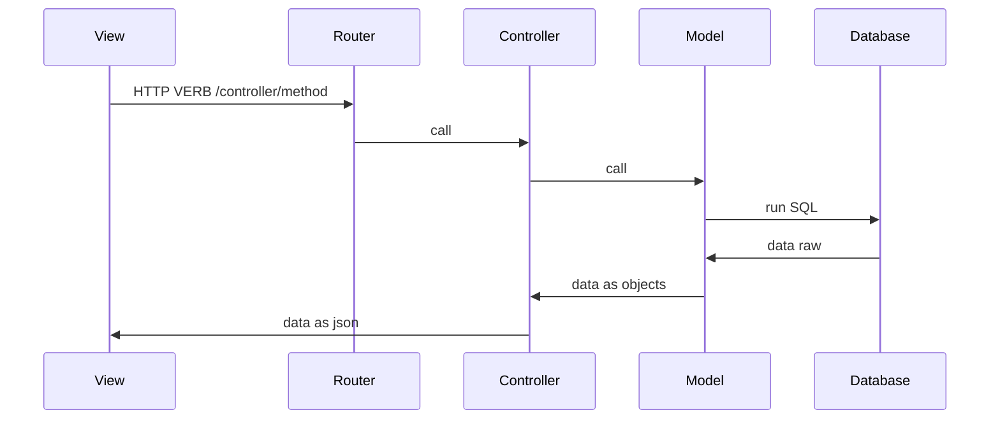

# mvc

```mermaid
sequenceDiagram
    participant V as View
    participant R as Router
    participant C as Controller
    participant M as Model
    participant D as Database
    V ->> R: HTTP VERB /controller/method
    R ->> C: call
    C ->> M: call
    M ->> D: run SQL
    D ->> M: data raw
    M ->> C: data as objects
    C ->> V: data as json
```
