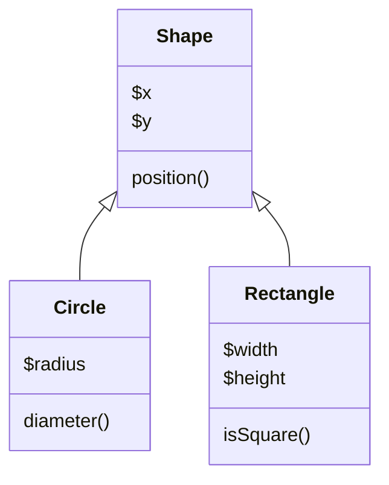

# inhertitance

```mermaid
classDiagram
    class Shape {
        $x
        $y
        position()
    }

    class Circle {
        $radius
        diameter()
    }
    Shape <|-- Circle

    class Rectangle {
        $width
        $height
        isSquare()
    }
    Shape <|-- Rectangle
```
